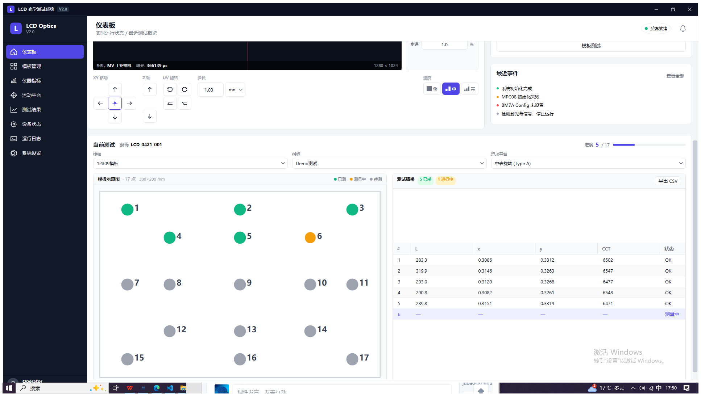
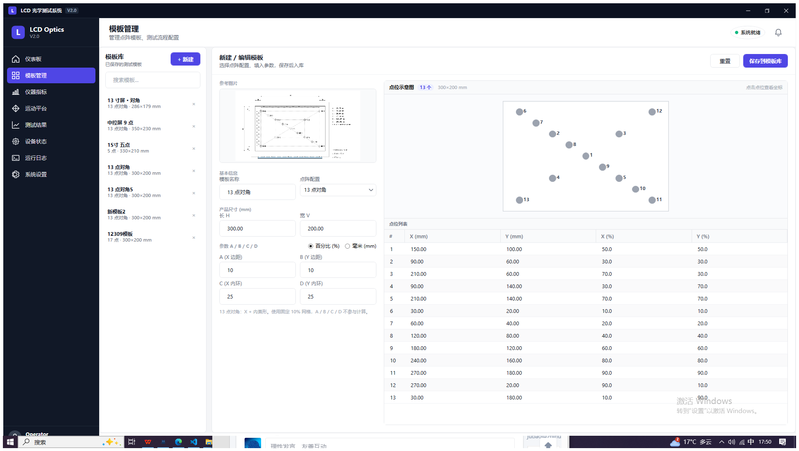
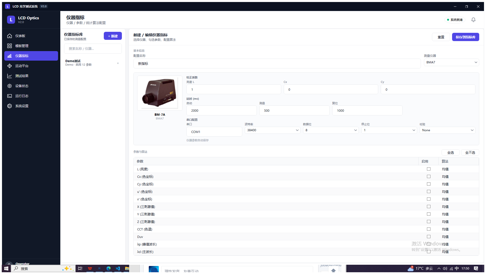
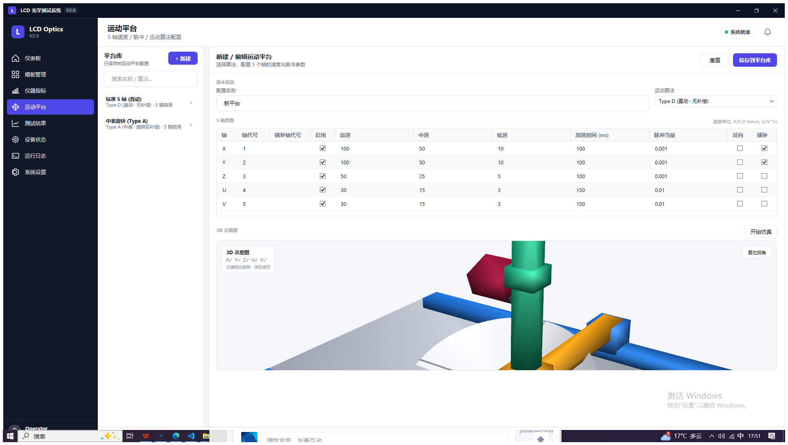
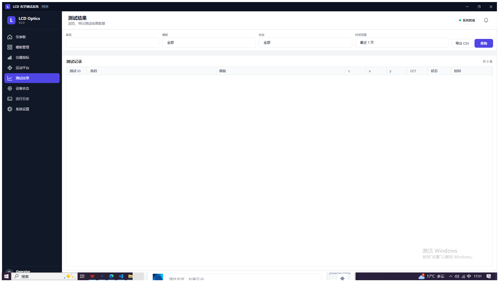
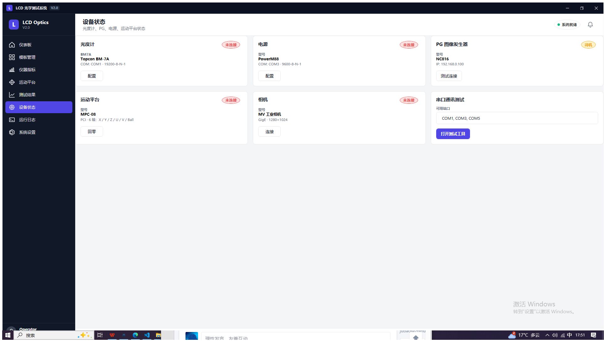
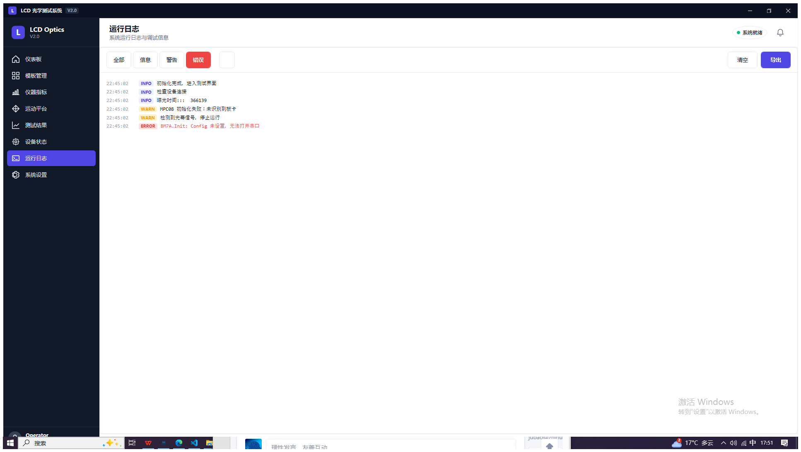
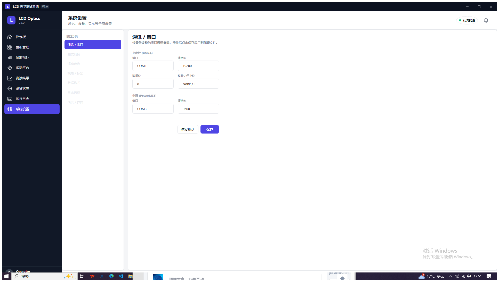

# LCD 光学测试系统

工业 LCD 光学测试系统，基于 WPF / .NET Framework 4.8。仓库包含两个并行的 UI：

- **LCD**：原始上位机（生产在用）
- **LCD_V2**：现代化 UI 重构 — 左侧导航 + 卡片式内容，封装后的 `LCD.Core` 业务层 + `LCD.Drv` 驱动层

项目结构：

```
LCD         # UI (legacy WPF front-end)
LCD.Core    # abstractions, models, services (PointLayoutService etc.)
LCD.Drv     # device drivers (MovCtrl, ProcessCtrl, instrument SDK wrappers)
LCD_V2      # modernised UI shell
```

## LCD_V2 页面

截图取自 `bin/Debug/LCD_V2.exe` 运行态（`scripts/capture-screens.ps1` 自动化捕获）。

### 仪表板

实时运行状态 / 最近测试概览。顶部：相机预览 + 手动微调 + 急停 / 开始 / 返回零点；底部："当前测试"面板把模板 / 指标 / 运动平台三个下拉绑到各自的 XML 库，左右联动显示模板点位示意图与测试结果表。下拉选项与参考线偏移在关闭时自动保存到 `%AppData%\LCD_V2\dashboard.xml`。



### 模板管理

点阵模板的库 / 编辑器布局。左侧模板库，右侧按配置（5/9/13/13 对角）+ 产品尺寸 H × V + ABCD 边距（mm 或百分比）生成点位，支持参考图预览与点位示意图点击查坐标。



### 仪器指标

按仪器（BM7A / CS2000 / …）维度管理测量参数与统计算法。左侧配置库，右侧显示仪器照片、校正系数、串口参数、参数启用与算法选择。



### 运动平台

5 轴运动平台配置 + 3D 示意图。轴表格：`轴代号 | 用作 | 启用 | 高 / 中 / 低速 | 加速时间 | 脉冲当量 | 反向 | 插补 | 插补轴代号`（插补轴代号只在勾选插补后可编辑）。下方 3D 视图实时跟随配置：X 勾选插补显示双直线滑块（龙门），U 使能把矩形载台替换为带旋转参考线的圆盘，V 使能让仪器在 Z 轴侧安装并可绕水平轴俯仰。"开始仿真" 两种模式：U 关时 3×3 点位巡航，U 开时转盘旋转 + X/Y 跟踪盘面红点 + V 同步摆动带动载台倾斜。



### 测试结果



### 设备状态



### 运行日志



### 系统设置



## 构建

Visual Studio MSBuild（经典 WPF csproj，`dotnet build` 不会跑 XAML 标记编译）：

```
"…/MSBuild/Current/Bin/MSBuild.exe" //p:Configuration=Debug LCD_V2/LCD_V2.csproj
```

## 数据目录

`LCD_V2` 的库 / 设置持久化到 `%AppData%\LCD_V2\`：

- `templates.xml`    — 模板库
- `metrics.xml`      — 仪器指标库
- `instruments.xml`  — 仪器参数
- `motion.xml`       — 运动平台库
- `dashboard.xml`    — 仪表板上次选择 + 参考线偏移
